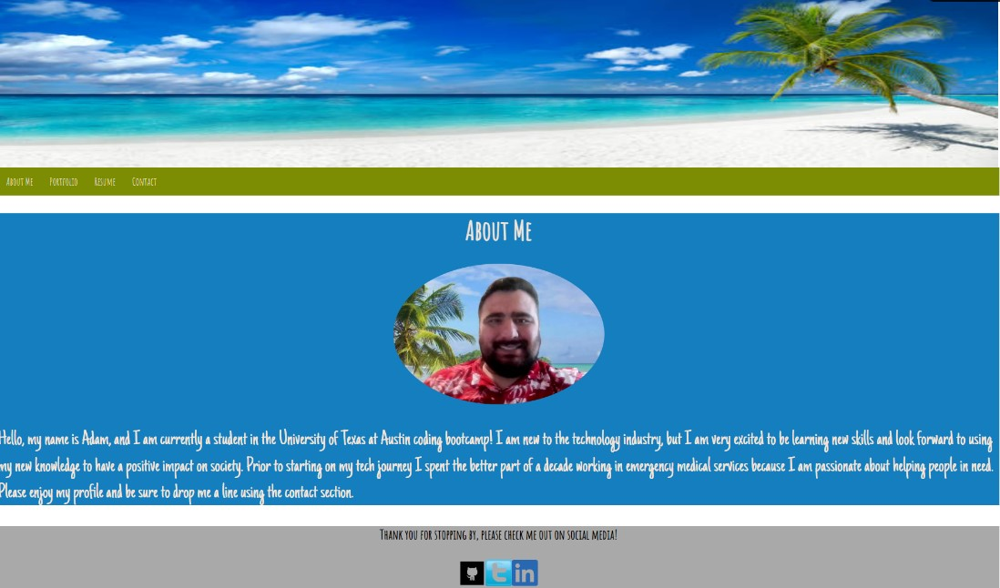

# React Portfolio Project

## Description

This is a portfolio page for Adam Wagh that was built using React. The portfolio is meant to showcase coding projects that Adam has done, and give people the opportunity to connect with him using a contact form. I made the decision to match the style of my first profile attempt so I could see how much I have improved. This project was built to satisfy the requirements of unit 20 of the University of Texas at Austin coding bootcamp. 
## How to Use
1) Visit the portfolio website [here]()
2) Use the navigation bar at the top of the page to move around my website.
3) When the page loads you will see the about me section of the page. This section contains a bit of background information about me. 
4) Click on the porfolio tab to view 6 projects I have coded over the course of the bootcamp, including my first portfolio project.
5) Click on the resume tab to view my resume. You will also be able to download my resume if you would like.
6) Click on the contact me tab to send me an email. 
7) Down at the footer of the page you will find links to my Github, Linkedin and Twitter profiles. Click on the appropriate icon to follow those links.
## Acknowledgements
I would like to thank my tutor Jack Linhart and Ian the TA for all of their invaluable help building this project. They spent a good deal of time ensuring that I understood the technology and file structure for using React. 

## License 
MIT License

Copyright (c) 2022 adamwagh512

Permission is hereby granted, free of charge, to any person obtaining a copy
of this software and associated documentation files (the "Software"), to deal
in the Software without restriction, including without limitation the rights
to use, copy, modify, merge, publish, distribute, sublicense, and/or sell
copies of the Software, and to permit persons to whom the Software is
furnished to do so, subject to the following conditions:

The above copyright notice and this permission notice shall be included in all
copies or substantial portions of the Software.

THE SOFTWARE IS PROVIDED "AS IS", WITHOUT WARRANTY OF ANY KIND, EXPRESS OR
IMPLIED, INCLUDING BUT NOT LIMITED TO THE WARRANTIES OF MERCHANTABILITY,
FITNESS FOR A PARTICULAR PURPOSE AND NONINFRINGEMENT. IN NO EVENT SHALL THE
AUTHORS OR COPYRIGHT HOLDERS BE LIABLE FOR ANY CLAIM, DAMAGES OR OTHER
LIABILITY, WHETHER IN AN ACTION OF CONTRACT, TORT OR OTHERWISE, ARISING FROM,
OUT OF OR IN CONNECTION WITH THE SOFTWARE OR THE USE OR OTHER DEALINGS IN THE
SOFTWARE.
